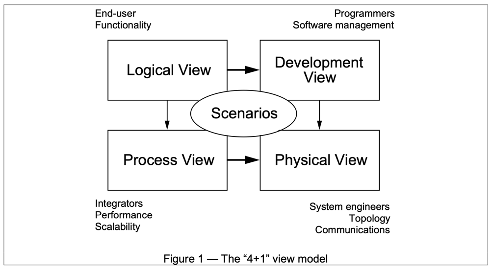

# 4 + 1 Architecture

## Overview
- Logical View (Object-Oriented Design)
- Process View (Threads / Processes and Concurrency / Synchronization)
- Physical View (The actual deployment)
- Development View (Components and artifacts)
- Scenarios (Use-cases)

## Scenarios
- The why
- Abstraction of the most important requirements
- Can be expressed with:
  - Use-case diagrams
  - Scenario / Interaction diagrams
  - Activity diagrams

## Process View
- Typically, software runs in one-or-more process (e.g. JVMs)
- Internally, a process has multiple threads responsible for servicing requests
- Processes communicate (synchronously as well asynchronously) with each other via
  - High-level products like database, cache, topics/queues
  - High-level protocols like REST/HTTP, gRPC
  - Built on low-level protocols like TCP/IP
- Supports multiple architectural styles
  - N-tier
  - Client-Server
  - Pipes and Filters
  - Microservices
  - Event Driven

## Physical View
- Mapping of the software to hardware
- Addresses non-functional requirements such as availability, reliability (fault-tolerance), performance (throughput), and scalability
- Support for different environments: dev, beta, prod, DR

## Logical View
- Class and associations typically Unified Modeling Language (UML)
- Entity-Relationship Diagrams (ERD)
- Ideally, starting with Domain-Driven Design (DDD)

## Development View
- Sub-system decomposition into layers
- Layers of libraries and other sub-systems

## Notes
- Not all views and needed for all architectures
- Mostly people focus on the Physical view

## References
1. [Architectural Blueprints—The “4+1” View Model of Software Architecture](https://www.cs.ubc.ca/~gregor/teaching/papers/4+1view-architecture.pdf)

---

# C4 Model
- Mainly static
- Zoom in / out

## Overview
- Context
- Container
- Component
- Code

## Context
- System Context Diagram
- A diagram as a box with people and other software systems
- People can be Users, roles, personas

## Container
- Where the code runs
- More like a process
- Containers communicate via inter-process calls (IPC)
- Contains many components
- Not docker

## Component
- Decompose container into various components
- Typically, maps to jars (wars, ears), dll, etc.

## Code
- Made up of code (classes, interfaces, etc.)
- UML class diagrams
- May be too detailed

## References
1. https://c4model.com
